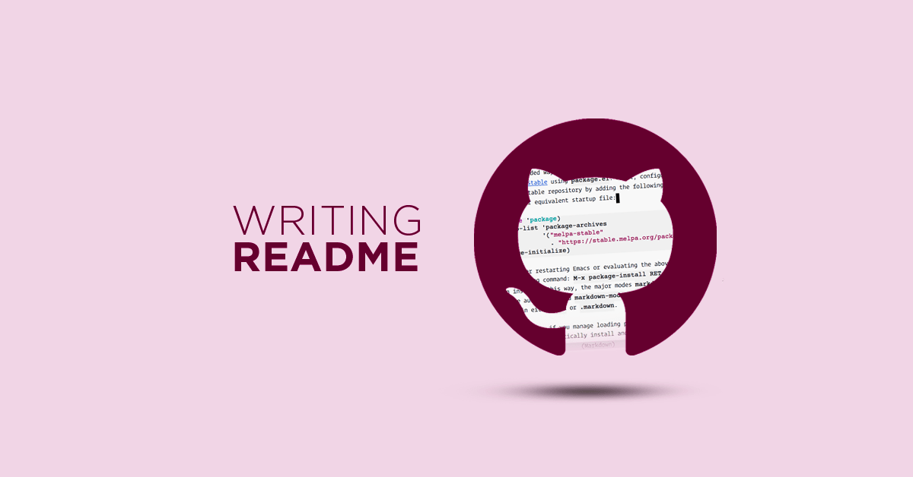

<!-- imagen usqando markdown
  
-->

<!-- imagem usando html -->

    

## Descrição do Projeto 

Um bom README é fundamental para garantir que qualquer pessoa, seja você ou outros desenvolvedores, consiga entender e contribuir de maneira eficiente no seu projeto. Comece com uma introdução clara sobre o que o projeto faz e qual problema ele resolve, incluindo requisitos e dependências necessários para rodá-lo. Descreva as instruções de instalação e como utilizar o projeto de forma simples e direta, para que até mesmo quem não tem familiaridade com o código consiga colocar tudo em funcionamento sem dificuldades.

Além disso, um README completo deve fornecer informações sobre como colaborar, reportar problemas (issues) e contribuir com o projeto. Incluir exemplos de uso, capturas de tela ou gifs pode ser útil para ilustrar o funcionamento do projeto de forma mais visual. Lembre-se de manter a documentação organizada, utilizando seções bem definidas e links úteis para garantir que os leitores encontrem rapidamente as informações de que precisam.

## Tabela de Conteúdos

<ul>
<li><a href = "#descricaoProjeto">Descrição do Projeto</a></li>
<li><a href = "#StatusProduto">Status Produto</a></li>
</ul>

<!-- 
 Centralizar a Lista
    <a href = "#descricaoProjeto">Descrição do Projeto</a> |
    <a href = "#StatusProduto">Status Produto</a>

-->

## Status do Projeto 

<h4 align="center">
    Em construção ::rocket::
</h4>